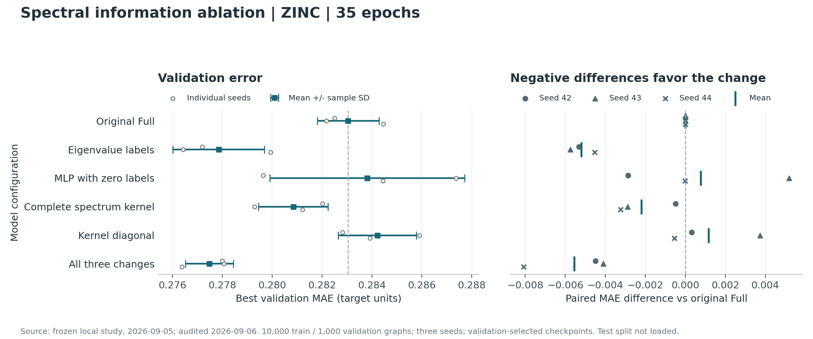

# 谱信息补全实验（2026-09-05）

本轮将外部 README 的建议落实为三个独立开关：频率标签读出、独立全谱核、
核对角节点通道。Full 的一阶场、二阶场与共享 GIN 全部保留。
本文件对应本地 GPS-style 实现，不能作为官方 GraphGPS / SignNet 复现成绩。

18 次训练于 9 月 5 日 22:47–23:43 完成，9 月 6 日完成复核和交替计时，
共 6 个配置 × 3 个种子 × 35 epoch。
推荐先启用频率标签单项：验证 MAE 从 **0.283042 ± 0.001234** 降到
**0.277851 ± 0.001841**（均值 ± 样本标准差），平均误差降低 **1.83%**，
三个种子都优于同机重跑基线。全谱核和核对角作为独立消融开关保留。

## 完整结果与取舍

以下数字按 seeds 42 / 43 / 44 排列，均为验证集选出的最佳 MAE：

- 原基线：0.282502 / 0.282171 / 0.284454；均值 **0.283042**；437,579 参数。
- 频率标签：0.277193 / 0.276431 / 0.279931；均值 **0.277851**；441,931 参数。
- 等容量无标签控制：0.279636 / 0.287361 / 0.284446；均值 **0.283814**；441,931 参数。
- 独立全谱核：0.282021 / 0.279296 / 0.281211；均值 **0.280842**；437,579 参数。
- 单独核对角：0.282819 / 0.285899 / 0.283918；均值 **0.284212**；437,707 参数。
- 三项组合：0.278008 / 0.278070 / 0.276372；均值 **0.277484**；442,059 参数。



频率标签相对基线的三个配对差为 -0.005309、-0.005740、-0.004523，
平均 -0.005191，描述性 95% t 区间 [-0.006724, -0.003657]。
相对等容量无标签控制，三个差值也均为负，平均 -0.005963；但对应区间
[-0.016955, 0.005030] 跨零。样本仅三个种子、进行了多项探索性比较且未校正，
因此结论是支持优先使用频率标签，不是完成了普遍的显著性或表达力证明。

全谱核平均改善约 0.78%，三个种子方向一致，但配对区间跨零。
单独核对角平均变差，暂不推荐开启。三项组合的平均误差最低，比基线降低约 1.96%，
但只在 seed 44 上超过频率标签单项，均值仅再降低约 0.000368。
本轮未分别测试“标签+全谱”和“标签+对角”，不能把组合差值归因于其中一个模块。
因此保留组合为可选候选，优先推荐改动较少的频率标签路径。

135 项测试覆盖既有行为、频率关联、符号/精确重根基旋转/节点置换不变性、
单图与批次一致性、全谱矩阵函数及参数梯度、空场和 CUDA BF16 更新。
18/18 运行和 36 个 best/last checkpoint 通过审计，最佳权重与最后提交中保存的
最佳模型逐张量相同；训练源码与运行时归档一致，测试集评估次数为 0。
原始默认配置可以严格加载旧版 437,579 参数 checkpoint。

## 时间记录的边界

训练期间同机游戏进程共享 GPU，部分 epoch 从约 2.5 秒升至约 8 秒。
因此各组总训练时间不用于宣称提速或估计固定的模块开销。
后续固定 B128 批次、使用 seed 42 的各组最佳权重，交替顺序测量 7 次、
每次 5 步预热和 20 步前向/反向/梯度裁剪；不包含装批、AdamW、IO。
中位数分别为：原基线 31.63、频率标签 36.37、无标签控制 33.69、
全谱核 35.43、核对角 34.02、三项组合 35.08 ms/step。
重复之间仍有明显波动，例如基线范围 28.11–36.49 ms/step。
这些是当前机器负载下的实测记录，不能据此精确断言频率标签比控制组慢多少；
本轮主要收益是验证精度，未得到提速证据。

机器可读的汇总和审计指纹见 [结果快照](MATH_FEATURES_20260905.json)。
原始完整记录在 `main/runs/math-features-20260905/`，包含计划、源码和运行器快照、
逐轮指标、全部 checkpoint、配对结果、交替计时原始采样及 `audit.json`。

## 数学定义与实现

### 带频率标签的字段读出

原来的 `rho(sum_F h_F)` 保留为 `frequency_labels=none`。新分支在字段求和前计算
`rho(sum_F MLP([h_F, lambda_a, lambda_b]))`：

- 一阶 singleton 和投影对角字段使用其块均值特征值，两列标签相同。
- 二阶字段使用两个 singleton 的特征值，按原来的低频 pair 顺序排列。
- 标签来自冻结谱，随字段一起搬运、填充和掩码，不使用任务标签。
- `eigenvalue` 输入真实频率；`blind` 使用相同 MLP、参数量和计算，但标签恒为零。
  两者的差值帮助区分频率信息与增加一层非线性/参数的效果。

这仍然是本项目的 SignNet 变体，不能据此把 `signnet_local` 改称公开 SignNet 基线。
新 MLP 在所有原有模块初始化后创建，同一随机种子的既有参数初值保持一致。

### 独立全谱核

`kernel_spectrum=pe` 使用既有低频谱及近简并块钳制。
`kernel_spectrum=all` 单独缓存全部 N 个特征值和特征向量，包括零空间，计算

\[
K_h=g_h(L)=g_h(0)I+U\operatorname{diag}(g_h(\lambda)-g_h(0))U^T.
\]

完整谱路径在实际特征值上计算响应，不做近简并硬分块。精确重根因共享标量响应而
自然保持基不变性；不等特征值之间的任意旋转不是原算子的对称性。
一阶 PE 仍保留最低 k=8 个正频率并补齐边界块，二阶仍用 k0=4 的安全 singleton pair。
完整谱路径在小图上使用密集分解；其 O(N²) 缓存不是大图的无成本默认。

上式先对 Bernstein 系数减去常数项，再做谱收缩，并解析地补回 `g_h(0)I`。
因此常数初始响应的非对角严格为零，不会把 FP32 的 `U U.T` 舍入误差经标准化放大。
单测比较了直接谱收缩的数值和参数梯度，也核验了与 NumPy 矩阵函数的一致性。

全部正频率之和通常是 `g(L)-g(0)P0`，不是完整 `g(L)`。本轮明确包含零模式。
孤立点仍遵循原 `L_sym` 的对角 1 约定；没有把这一约定变更混入本轮变量。
全谱核也不意味着整个 PE 模型获得扰动稳定性定理：绝对场仍有分块/截断，
偏差标准化在小方差区域仍敏感。

### 原始核对角节点通道

`kernel_diagonal=True` 将每头的原始 `diag(K_h)` 通过无偏置线性投影加入 `node_pe`，
随后沿用原有 token 融合。该投影从零初始化，初始节点路径与对应无对角分支相同。
注意力继续使用同一份原始核的非对角标准化结果，没有重复计算谱收缩。
4 头、Full 的 32 维 PE 共增加 128 个参数。关闭注意力偏差时，该节点通道仍可单独工作。

Lite 也支持对角通道；没有把简并块的逐列平方直接作为输入。
逐场 RMS 归一化与简并块乘积暂未并入这组消融，避免混淆三项改动的归因。

## 冻结的实验协议

- ZINC subset：全量 10,000 张训练图、1,000 张验证图。测试划分不加载、不评估。
- Full，10 层、宽 64、4 头；PE 每分支 16 维、GIN 宽 32；k=8、k0=4。
- `field_scaling=size`、B128、AdamW lr=0.001、Cosine、35 epoch、BF16、4 CPU threads。
- 固定 seeds 42/43/44，每个种子轮换六个配置的执行顺序，样本顺序使用独立生成器。
- 六个配置：原基线、频率标签、等容量无频率标签控制、全谱核、核对角、三项组合。
- 骨干和训练预算相同；新增参数量单列，不宣称六组严格等参数。
- 每次运行按验证 MAE 选择最佳 checkpoint。保留逐轮记录和全部成功/失败证据。
- 预先保存 `plan.json`、源码归档、runner 指纹和数据指纹，每次训练前后检查源码未变。
- 同机重新训练基线；历史 RTX 5070 Laptop 的运行时间不与本机 RTX 5070 Ti 混比。

训练缓存升级到 v2，新增频率标签和可选完整核谱；旧缓存和旧 checkpoint 不覆盖。
主训练器默认只加载 train/val，只有显式 `--evaluate-test` 才加载 test。

## 重做实验与独立调用

推荐的频率标签单项配置（保留原低频核、关闭核对角）：

```powershell
.\.venv\Scripts\python.exe -m ast_boost.experiments.train `
  --methods full --field-scaling size --batch-size 128 --scheduler cosine `
  --epochs 35 --seeds 42 43 44 --frequency-labels eigenvalue `
  --kernel-spectrum pe --output runs/my-frequency-candidate
```

公共 API 和 CLI 的原默认值保持兼容；推荐候选通过上述开关显式启用。

从 `main/` 运行完整对照：

```powershell
.\.venv\Scripts\python.exe benchmarks/experiment_math_features.py `
  --output runs/my-math-features --epochs 35 --seeds 42 43 44
```

相同源码和协议下，中断恢复追加 `--resume`。新研究使用新的输出目录。
可用 `--presets` 选择配置子集，但不得把不同协议混成一次配对实验。

单独训练三项组合：

```powershell
.\.venv\Scripts\python.exe -m ast_boost.experiments.train `
  --methods full --field-scaling size --batch-size 128 --scheduler cosine `
  --epochs 35 --seeds 42 43 44 --frequency-labels eigenvalue `
  --kernel-spectrum all --kernel-diagonal --output runs/my-math-combined
```

直接使用公共适配器时，完整核谱通过预计算对象传入：

```python
from ast_boost import ASTBoostPE, precompute_spectrum, prepare_spectrum

low = precompute_spectrum(edge_index, n=n, k=8)
complete = precompute_spectrum(
    edge_index, n=n, k=n, skip_zero=False, dense_threshold=max(256, n)
)
prepared = prepare_spectrum(low, kernel_spectrum=complete, k0_pairs=4)
pe = ASTBoostPE(
    variant="full", heads=4, token_dim=64, frequency_labels="eigenvalue",
    kernel_spectrum="all", kernel_diagonal=True,
)
tokens, bias = pe(node_tokens, prepared, edge_index)
```

`prepare_spectrum_batch` 可以将这些预计算对象装批。单图、padded/disjoint batch、
packed sparse/dense 和裁剪 padding 路径均有一致性检查。
